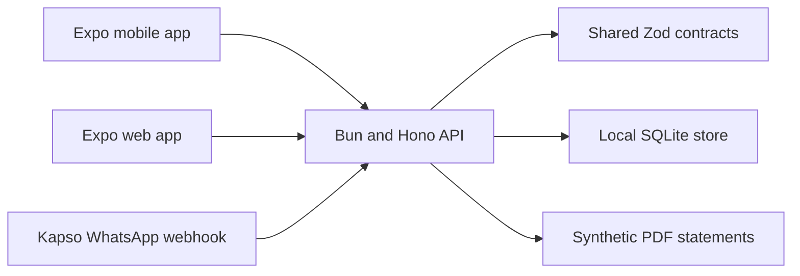
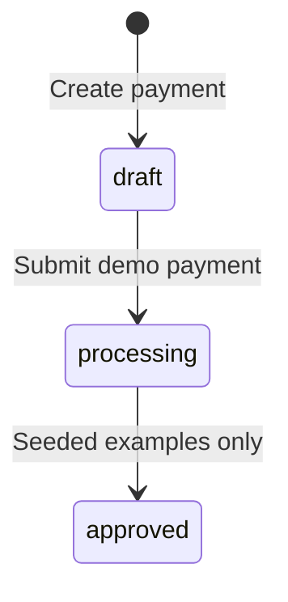

# Architecture

The demo keeps one contract across every channel. Web, iOS, Android, and WhatsApp all call the same treasury service. This makes the channel experience consistent and keeps business behavior outside presentation code.

## Data path

1. The client sends validated JSON to a versioned endpoint.

2. The API validates input again with the shared Zod contract.

3. The treasury service applies the demo state transition.

4. SQLite persists beneficiaries and simulated payments.

5. The API returns the canonical response used by every interface.

## Payment state model

The public interface can create and submit payments. It cannot approve them or communicate with financial infrastructure.

## WhatsApp behavior

The inbound handler accepts Kapso webhook version two payloads. Signature validation runs before parsing. Text questions call the same assistant service as the app. Responses use plain text and native links. Statements use a PDF document attachment. No generated status images are necessary.

The local simulation endpoint returns the exact assistant payload without making an external request. This keeps assessment setup deterministic while leaving the real Kapso transport ready for controlled credentials.
